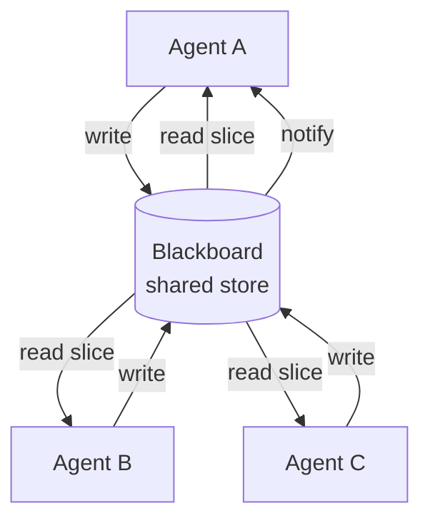

# Source capture: Blackboard — Agent Patterns Catalog

- **URL:** https://www.agentpatternscatalog.org/patterns/blackboard/
- **Diagram anchor:** https://www.agentpatternscatalog.org/patterns/blackboard/#diagram
- **Landing (summary):** https://www.agentpatternscatalog.org/landing/patterns/blackboard/
- **Provenance (catalog):** `patterns/blackboard.md` on GitHub, commit `4fa1213` (added 2026-04-30; last updated 2026-05-21)
- **Captured:** 2026-08-05
- **Note:** Interactive diagram/neighbourhood UI did not serialize via fetch; mermaid diagram and full markdown fields below are from the catalog’s published pattern source (same content as the live page). Sections marked *landing only* appear on the landing page.

---

# Blackboard

**Also known as:** Shared Workspace, Collaboration Whiteboard

**Category:** Multi-Agent
**Status in practice:** experimental

## Intent

Give multiple agents a shared, queryable workspace they can read from and write to as they collaborate.

## Context

Several specialised agents are working on a shared artefact — a document being annotated by a layout-extractor, table-parser, citation-resolver, and summariser; a code review where multiple analysers contribute findings — and each needs to see what the others have already produced before deciding what to do next. The agents are not in a fixed pipeline; the order of useful contributions depends on what is already on the page.

## Problem

If the agents work in isolation, they cannot build on each other's findings and duplicate or miss work. If they message each other point to point, every new agent forces edits to every other agent that should hear from it, and the protocol grows into a brittle web. If they share an unstructured mutable workspace without discipline, concurrent writes race and overwrite useful intermediate state. The team needs a coordination shape that is more flexible than a strict pipeline but more disciplined than free shared memory.

## Forces

- Concurrent writes need conflict resolution.
- Blackboard contents grow; pruning is needed.
- Read latency: pulling vs subscribing.

## Therefore

Therefore: give the agents one inspectable shared workspace they read from and write to under structured keys, so that coordination becomes 'contribute what you can' without any agent knowing about another directly.

## Solution

Establish a shared store (file, database, in-memory). Each agent reads the relevant slice and writes its contribution under structured keys. Optional event notification when keys change. Conflict resolution is policy-driven (last-write-wins, version-vector, append-only).

## Example scenario

A document-processing pipeline has a layout-extractor agent, a table-parser, a citation-resolver, and a summariser, each strong on its own but needing each other's intermediate outputs. Wiring direct messages between every pair becomes a brittle protocol. They adopt a Blackboard: each agent posts its findings to a shared workspace and subscribes to relevant updates, with a controller deciding who runs next. Coordination becomes 'read what's on the board, contribute what you can'.

## Diagram

## Consequences

**Benefits (gives)**

- Loose coupling: agents do not know about each other directly.
- Inspectable shared state.

**Liabilities (costs)**

- Race conditions under concurrent writes.
- Blackboard bloat without pruning.

## What this pattern constrains (forbids)

Cross-agent communication happens only via the blackboard; out-of-band agent-to-agent calls are forbidden.

## Applicability

**Use when**

- Multiple agents collaborate and need a shared workspace they can read from and write to.
- Explicit point-to-point messaging would require an over-engineered protocol for the coordination shape.
- Conflict resolution policy (last-write-wins, version-vector, append-only) is acceptable for the workload.

**Do not use when**

- Agents already coordinate fine through direct messages or function calls.
- Shared mutable state without strict discipline would race in ways the chosen policy cannot handle.
- Workload requires strict transactional semantics the blackboard does not provide.

## Known uses

- **Classical AI blackboard architectures** — *Available*
- **Multi-agent code review with shared scratchpad** — *Available*

## Related patterns / neighbourhood (from live catalog page)

Larger patterns this helps complete:

- *used-by* → SOP-Encoded Multi-Agent Workflow — Encode a human Standard Operating Procedure (roles, ordered phases, standardised hand-off artefacts) into a multi-agent pipeline so that agents communicate through structured documents rather than free-form chat.

Smaller patterns that complete this one:

- *generalises* → Stigmergic Coordination — Agents coordinate indirectly by leaving and reading marks in a shared environment (files, queues, scratchpads, world model) so that one agent's trace stimulates another's next action, with no direct messaging.

Alongside / against:

- *complements* → Swarm — Run many peer agents that interact directly without a central supervisor, achieving emergent coordination.
- *alternative-to* → Supervisor — Place a coordinating agent above a set of specialised agents and route work to them.
- *complements* → Append-Only Thought Stream — Make the agent's thought log append-only so the agent cannot rewrite its own history.
- *composes-with* → Graph of Thoughts — Model reasoning as an arbitrary DAG so thoughts can be merged, refined, and aggregated across branches.
- *alternative-to* → Topic-Based Routing — Route inter-agent messages through named topics that agents subscribe to, instead of having senders address each other by id.
- *alternative-to* → Cellular-Automata Agents — A swarm where each agent applies simple local rules to its immediate neighborhood; macro behavior emerges without a central orchestrator and without global information access.
- *alternative-to* → Distributed Constraint Optimization — A group of agents jointly assigns values to shared variables to minimise (or maximise) a global cost defined by inter-agent constraints, exchanging only the messages needed.
- *complements* → Partial Global Planning — Each agent maintains a partial view of others' plans and incrementally merges local plans into a shared partial global plan, interleaving coordination with execution.

Related patterns listed in the GitHub pattern source (subset):

- *complements* → swarm
- *alternative-to* → supervisor
- *complements* → append-only-thought-stream
- *composes-with* → graph-of-thoughts
- *used-by* → sop-encoded-multi-agent

## Used in recipes

- Classical MAS Coordination (optional)
- Multi-Agent Coordination (optional)

## Used in frameworks

- **AgentVerse** — supported; Shared environment state.
- **CopilotKit** — first-class; Shared State is a single synchronized state layer both the agent and the UI components read from and write to.
- **Dendron** — core; every Dendron behavior tree has an associated Blackboard, a key-value mapping accessible by all nodes in the tree (nodes share state this way since direct node-to-node messaging is not the model).

## References

- (book) *Blackboard Systems* (Engelmore, Morgan), 1988

## Tags (catalog)

multi-agent, blackboard, shared-state
